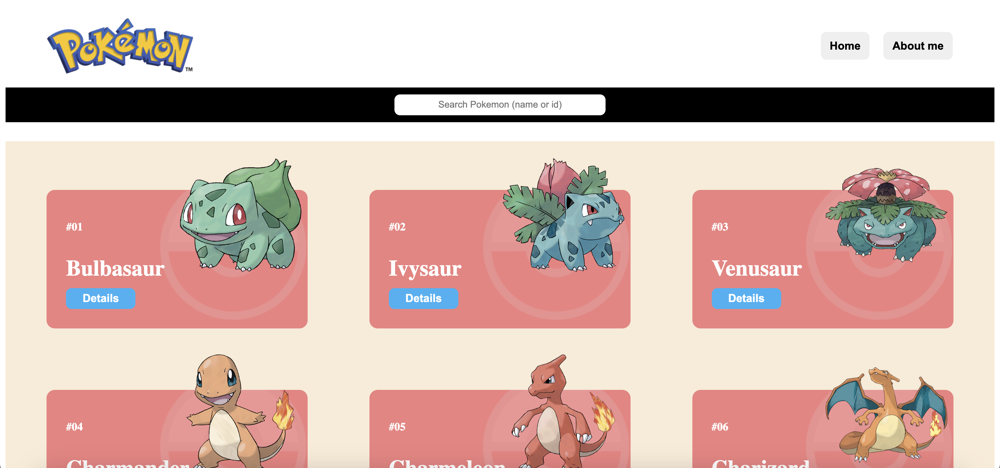
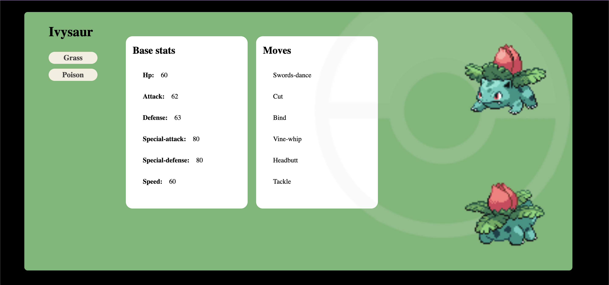
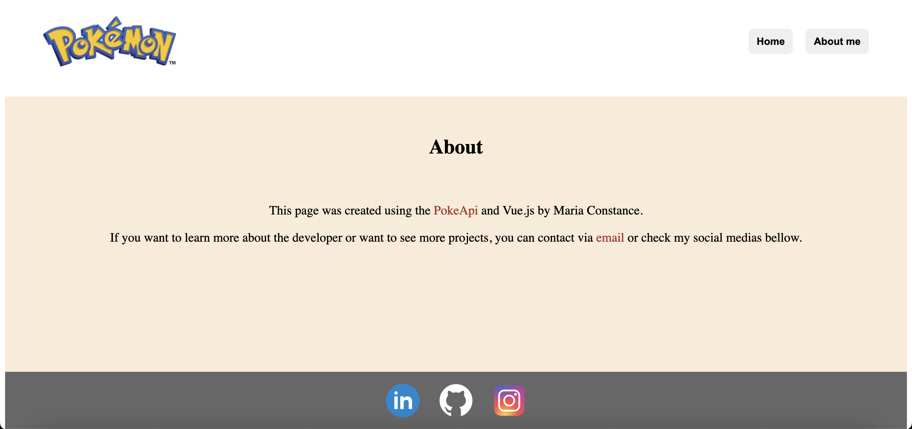

# **Project Pokemon API with Vue**

The Pokemon API with Vue is a website with cards and information about Pokemons, that contains two pages (Home and About) and one menu (Details). The project has, as a source of data, the [Poke API](https://pokeapi.co/ "Poke API").

## **Index**
- <a href="#project-functionalities">Project functionalities</a>
- <a href="#layout">Layout</a>
- <a href="#deploy">Deploy</a>
- <a href="#how-can-i-run-this-project">How can I run this project?</a>
- <a href="#tech-stack">Tech stack</a>
- <a href="#creators">Creators</a>

## **Project functionalities**
- [x] List of cards on the home page with Pokemon name and image
- [x] Menu with information about each Pokemon
- [x] Page with information about the creator and project
- [x] Input available to search by Pokemon name or id
- [x] Fully responsive for all types of devices/screens

## **Layout**




## **Deploy**
[Link deploy]()

## **How can I run this project?**

```
# Clone this repository
$ git clone link-repositorio

# Acess the project folder on your terminal
$ cd pokemon-api-vue

# Install dependencies
$ npm install

# Run application
$ npm run dev

```

## **Tech stack**

1. [Vue](https://vuejs.org/)
2. [Axios](https://axios-http.com/)


## **Creators**


[Linkedin](https://www.linkedin.com/in/mariaconstance/)
